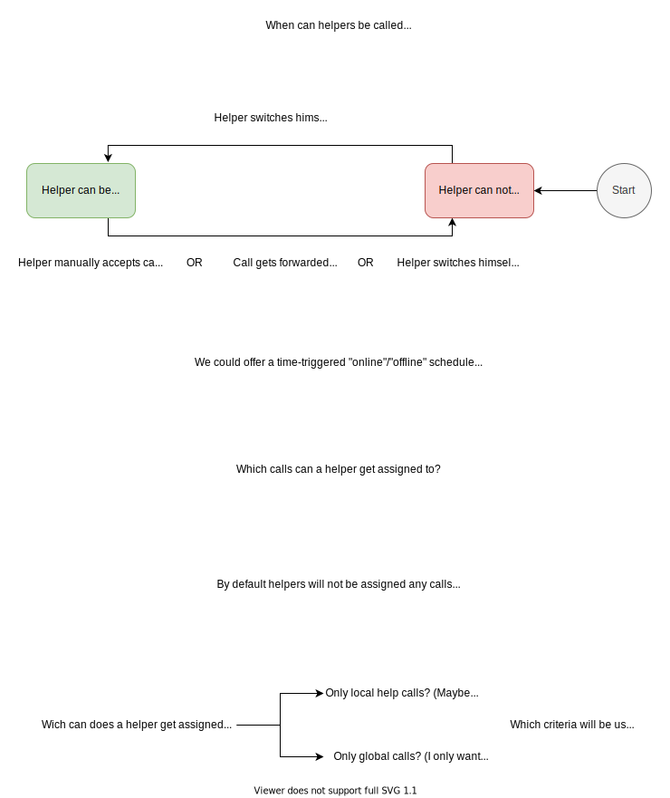

[*See Frontend Repository*](https://github.com/helperline/web-frontend)

## HelperLine (Backend) - A Hotline for People without Internet Access

#### Tech Stack

* React Frontend
* Flask Backend

* Heroku (AWS) Cloud Hosting
* Heroku Postgres Database

* Twilio for SMS, Phone and Email Communication
* Google Maps for Map Components

  

## Description of our Matching 

